# 游戏系统架构图

## 1. 整体架构图

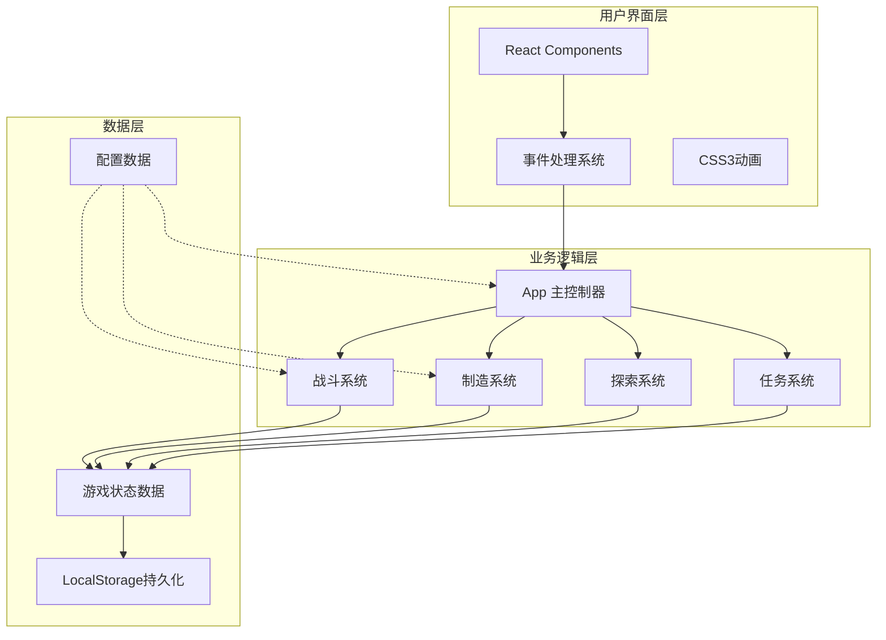

## 2. 游戏核心循环

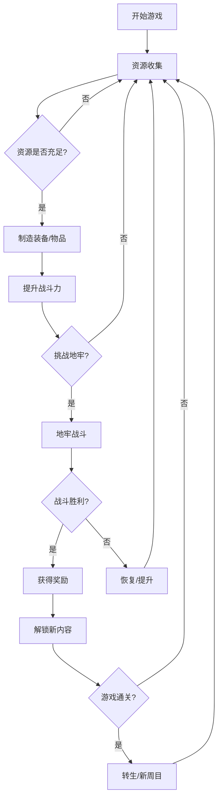

## 3. 数据文件依赖关系

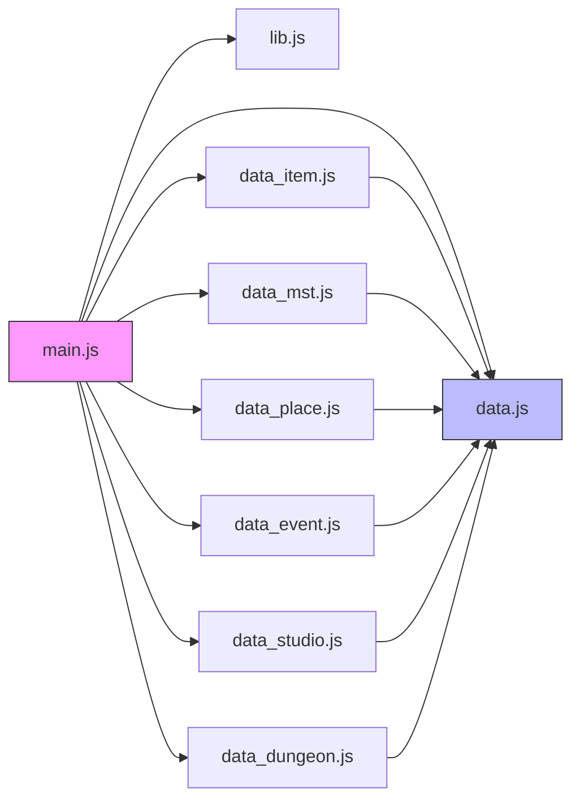

## 4. 状态系统设计

### 4.1 核心状态流转图

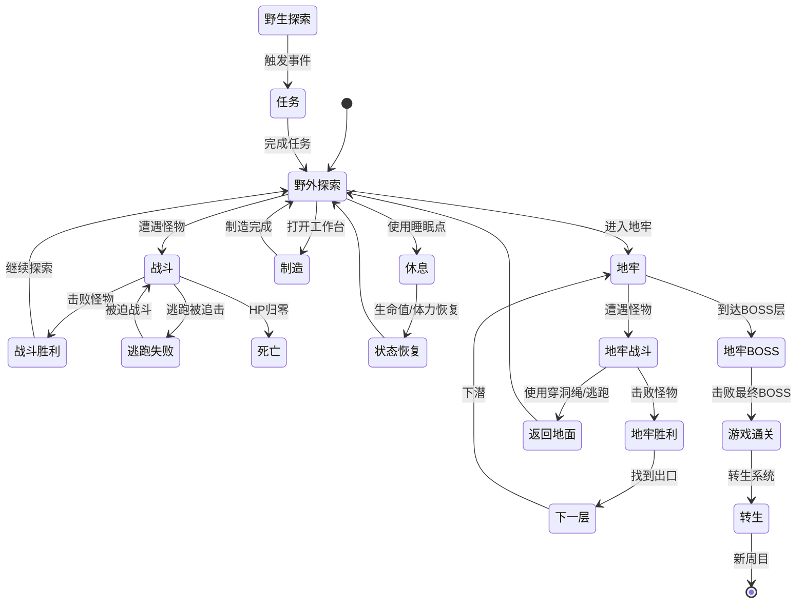

### 4.2 角色状态变化

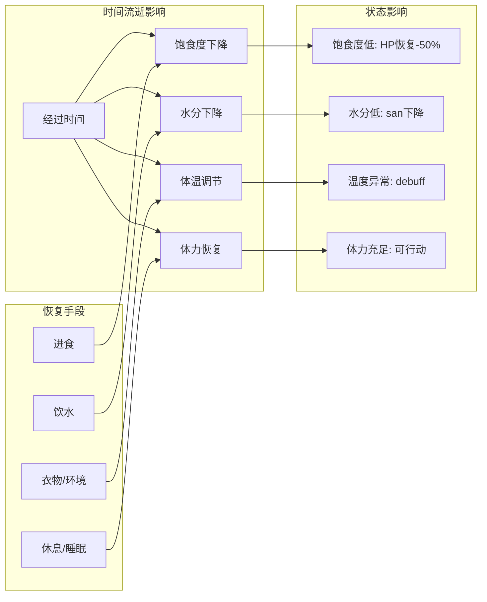

## 5. 战斗系统流程

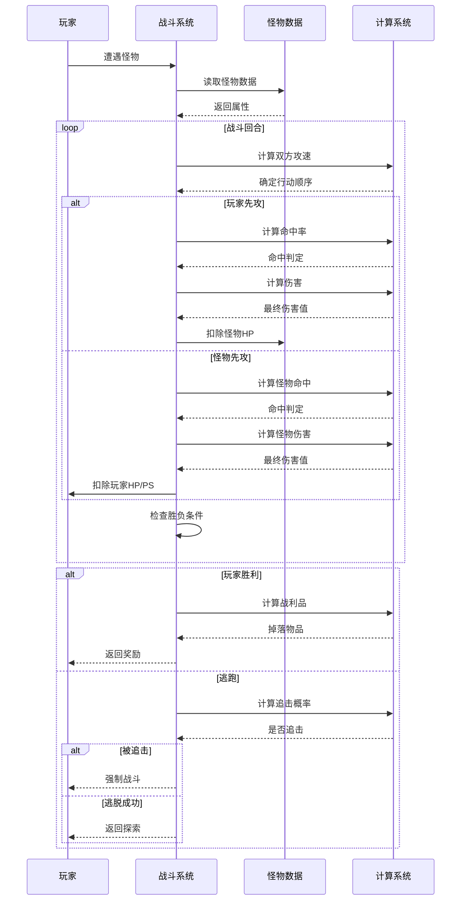

## 6. 制造系统流程

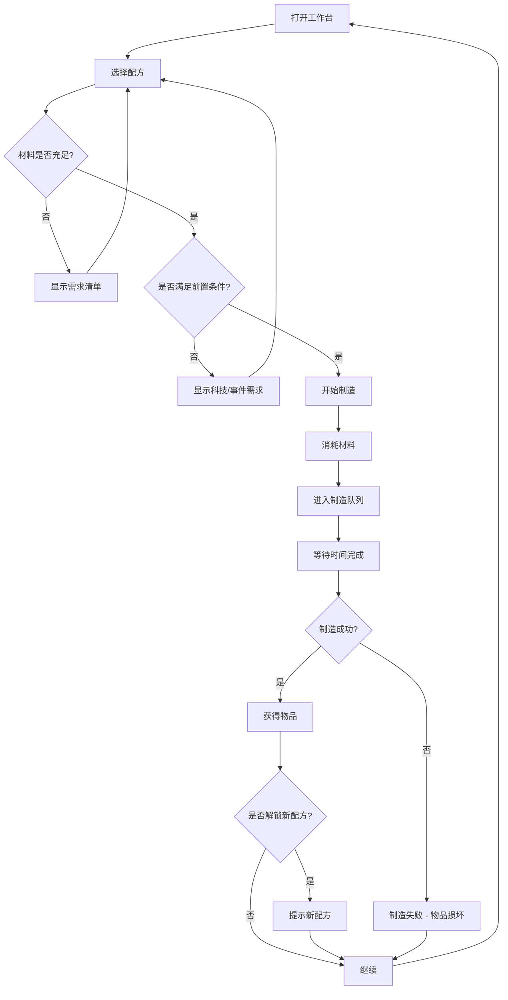

## 7. 任务链系统

```mermaid
graph TD
    subgraph 村长任务链
        A[robberQuestGet] -->|接受任务| B[robberQuest]
        B -->|击杀盗贼| C[spiderQuestGet]
        C -->|接受任务| D[spiderQuest]
        D -->|击杀蛛魔之后| E[dragonQuestGet]
        E -->|接受任务| F[dragonQuest]
        F -->|击杀龙王| G[gulf]
        G -->|对话水手| H[藏宝湾解锁]
    end
    
    subgraph 地精工匠链
        I[goblin] -->|修车| J[goblin_1]
        J -->|学罗盘| K[goblin_2]
        K -->|学干扰装置| L[goblin_3]
        L -->|学急冻枪| M[goblin_4]
        M -->|学探测帽| N[goblin_5]
        N -->|学车床| O[goblin_end]
        O -->|商店开启| P[购买零件]
    end
    
    subgraph 战争阵营
        Q[iceTownEvent] -->|选食人魔| R[iceTownEvent_1]
        R --> S[iceTownEvent_2]
        S --> T[iceTownEvent_3]
        T --> U[iceTownEvent_end]
        
        Q -->|选法师| V[fireTownEvent_1]
        V --> W[fireTownEvent_2]
        W --> X[fireTownEvent_3]
        X --> Y[fireTownEvent_end]
    end
```

## 8. 地牢系统架构

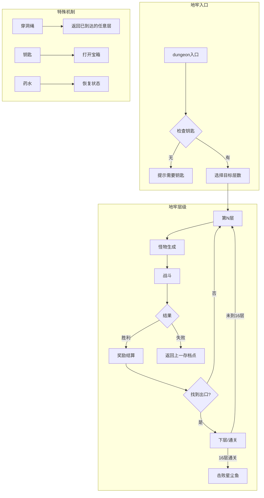

## 9. 经济系统闭环

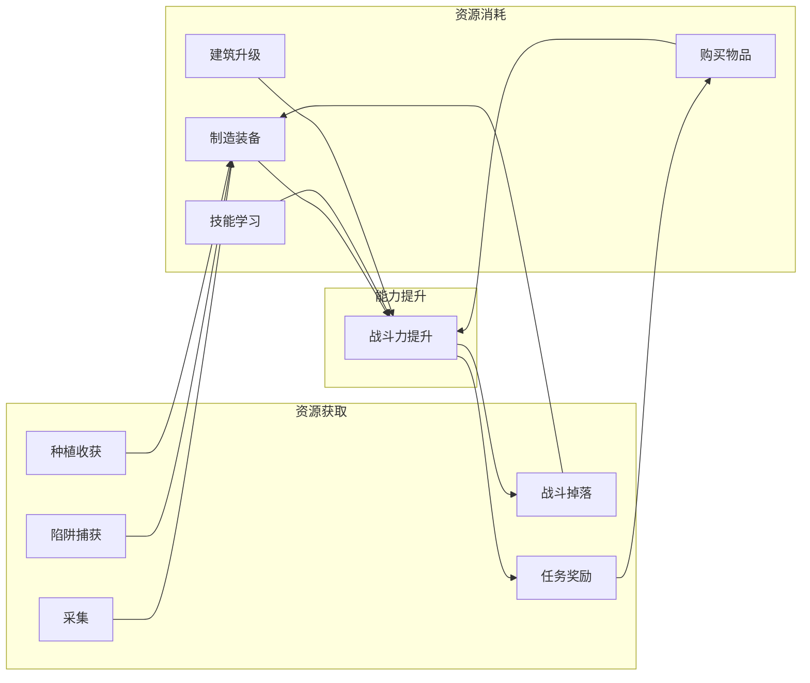

## 10. 组件之间的关系图

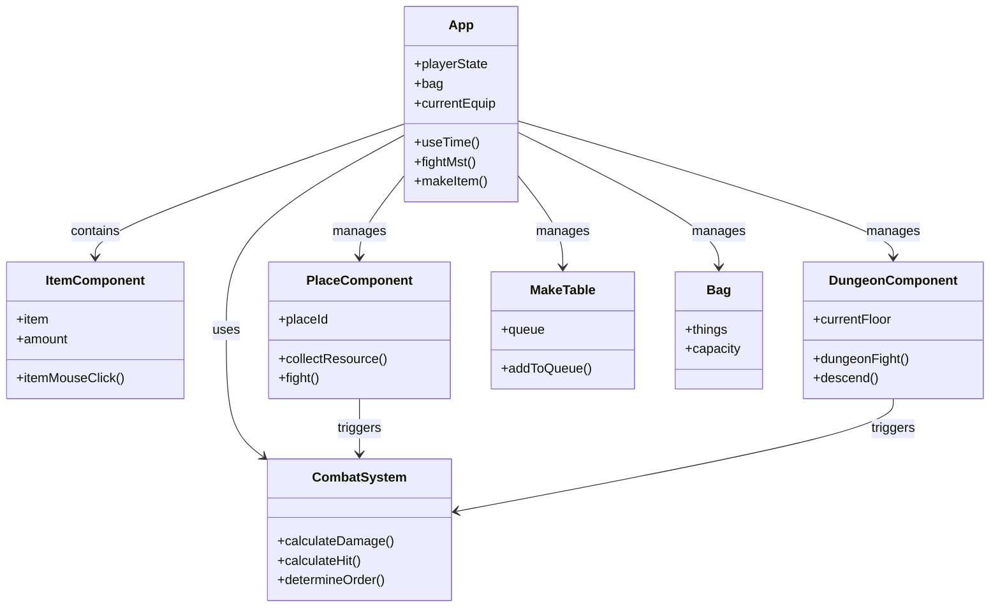

这是一个完整的、自洽的游戏系统架构，涵盖了从UI层到数据层的完整技术栈。
